# Визуальные схемы ManBot

Этот файл показывает процесс работы ManBot визуально: от самой простой схемы до более сложной архитектуры с параллельным выполнением.

Mermaid-диаграммы можно смотреть прямо в GitHub, VS Code с Mermaid Preview или любом Markdown-просмотрщике с поддержкой Mermaid.

## 1. Самая простая схема

Это минимальное понимание проекта:

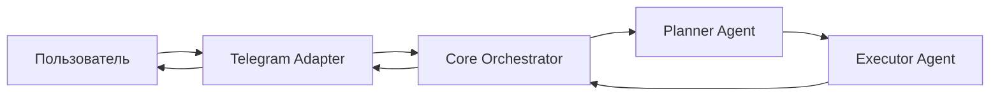

Смысл:

```text
Пользователь пишет сообщение.
Telegram Adapter принимает его.
Core Orchestrator управляет задачей.
Planner строит план.
Executor выполняет план.
Ответ возвращается пользователю.
```

## 2. Схема с внутренними сервисами

Это уже ближе к реальному устройству проекта:

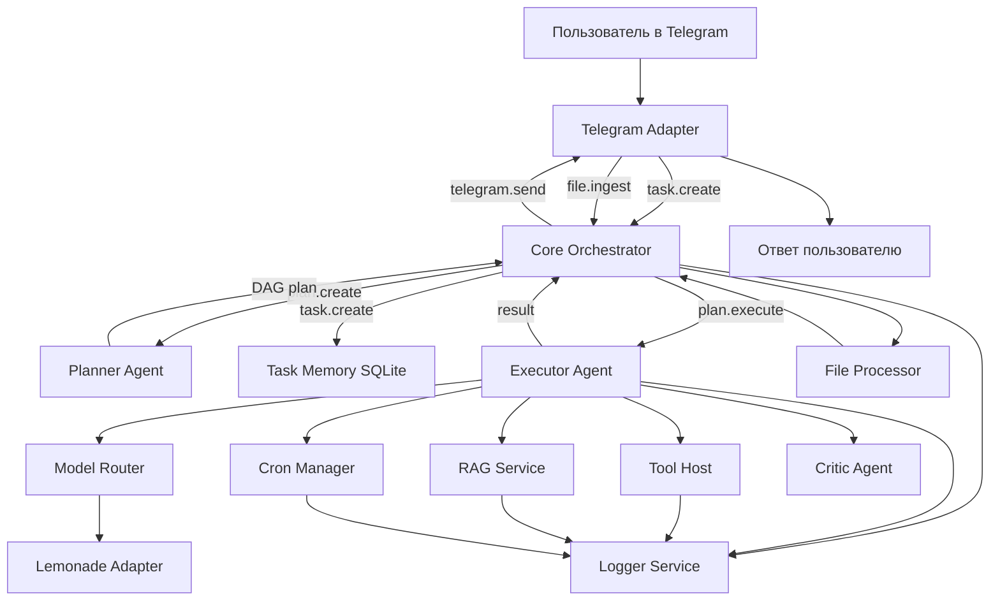

Ключевая идея:

```text
Core Orchestrator не делает всю работу сам.
Он управляет процессами и отправляет сообщения нужным сервисам.
```

## 3. Сообщения внутри системы

Все процессы общаются через Envelope:

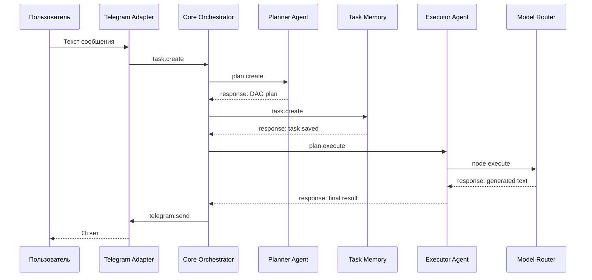

Каждое внутреннее сообщение имеет форму:

```ts
{
  id: string,
  from: string,
  to: string,
  type: string,
  payload: unknown,
  timestamp: number,
  version: "1.0"
}
```

## 4. Как Planner превращает цель в DAG

Пользовательская цель:

```text
Найди информацию, сравни варианты и дай вывод.
```

Planner может превратить ее в такой граф:

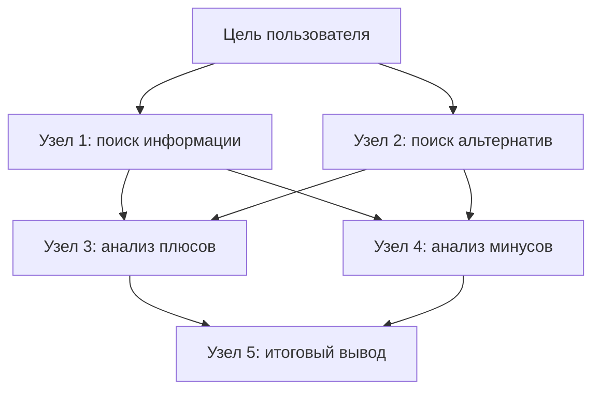

DAG означает:

```text
Directed Acyclic Graph
Направленный граф без циклов.
```

То есть шаги идут вперед и не зацикливаются.

## 5. Параллельное выполнение

Некоторые задачи не зависят друг от друга. Executor может выполнять их параллельно.

Пример:

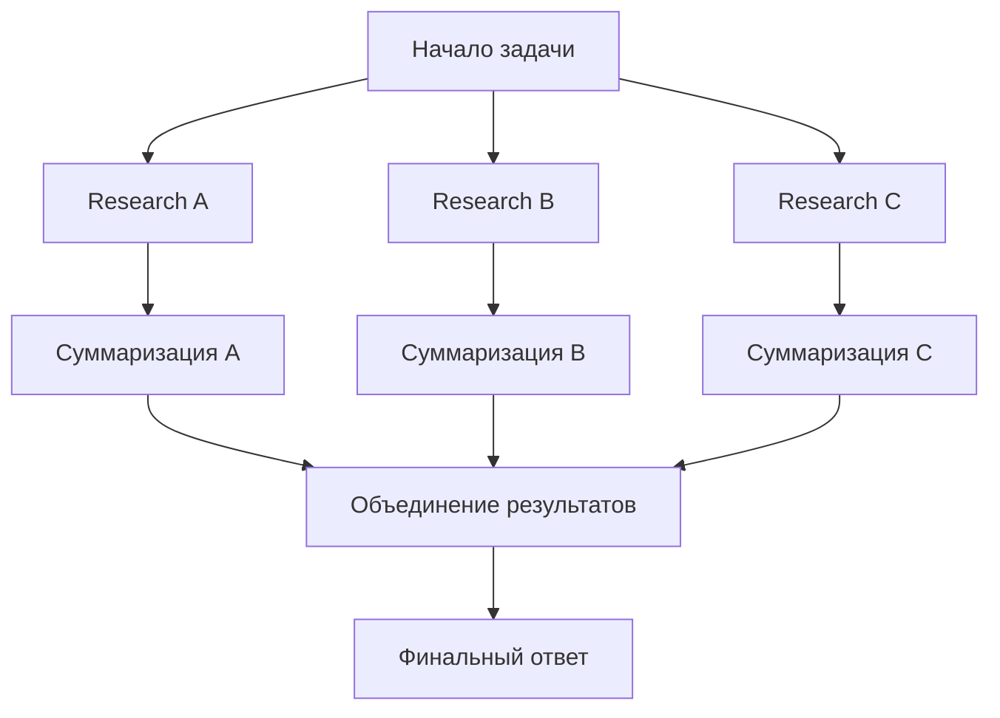

Что здесь происходит:

```text
Research A, Research B и Research C можно запустить одновременно.
После них каждая ветка суммаризируется.
Потом результаты объединяются.
Финальный ответ строится только после объединения.
```

В Executor это работает через:

```text
getDependencyMap()
getReadyNodes()
completedIds
nodeOutputs
```

Executor постоянно спрашивает:

```text
Какие узлы уже можно запускать?
Все ли зависимости выполнены?
Какие результаты надо передать дальше?
```

## 6. От простого к сложному: три уровня проекта

### Уровень 1: простой бот

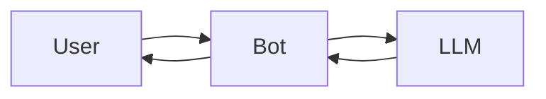

Плюсы:

- быстро сделать;
- мало кода;
- легко понять.

Минусы:

- нет памяти задач;
- нет нормального планирования;
- сложно добавлять инструменты;
- сложно отлаживать;
- все смешано в одном месте.

### Уровень 2: бот с сервисами

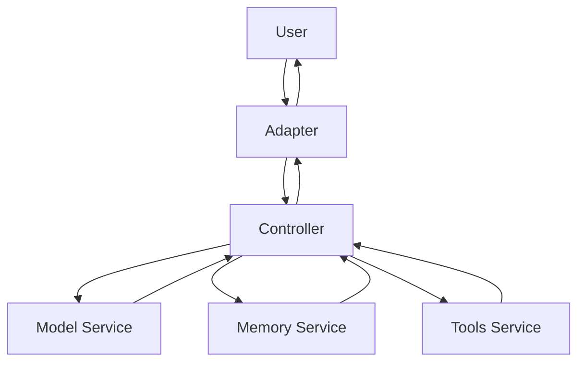

Плюсы:

- код разделен по ролям;
- проще тестировать;
- можно добавлять память и инструменты.

Минусы:

- Controller все еще сам решает порядок работы;
- нет полноценного DAG;
- сложные задачи выполнять труднее.

### Уровень 3: ManBot-style платформа

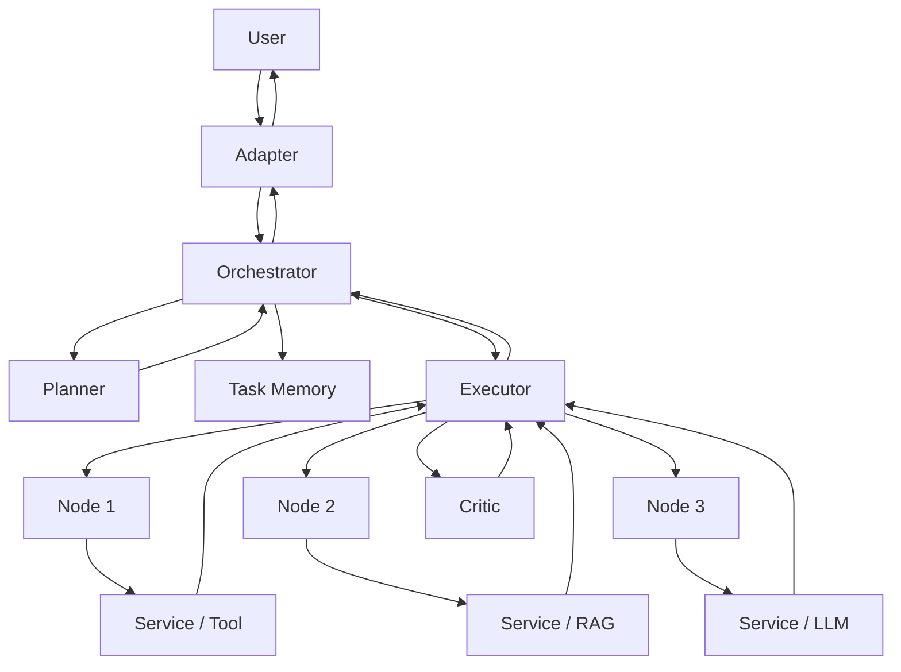

Плюсы:

- сложные задачи разбиваются на план;
- можно выполнять независимые шаги параллельно;
- сервисы изолированы;
- проще расширять систему;
- можно добавлять новые агенты, инструменты и память.

Минусы:

- архитектура сложнее;
- нужно понимать протокол сообщений;
- сложнее отладка без логов и диаграмм.

## 7. Разные результаты выполнения

Одна и та же система может давать разные пути выполнения в зависимости от задачи.

### Простая задача

Пример:

```text
Скажи кратко, что такое RAG.
```

Процесс:

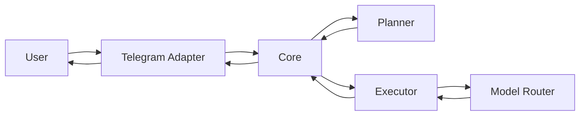

Здесь почти не нужны инструменты. Достаточно LLM-ответа.

### Средняя задача

Пример:

```text
Найди информацию на сайте и перескажи.
```

Процесс:

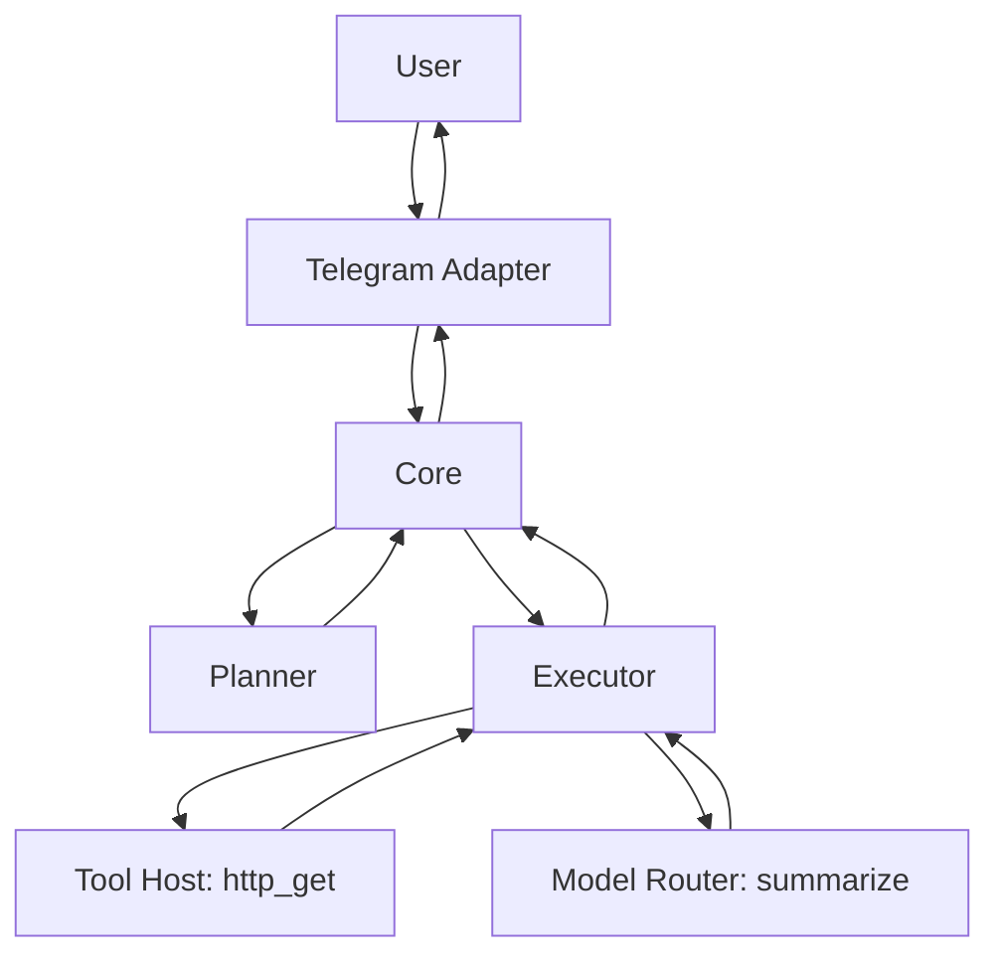

Здесь уже нужен инструмент `http_get`, потом модель суммаризирует результат.

### Сложная задача

Пример:

```text
Исследуй тему, сравни источники, сделай вывод и сохрани важное в память.
```

Процесс:

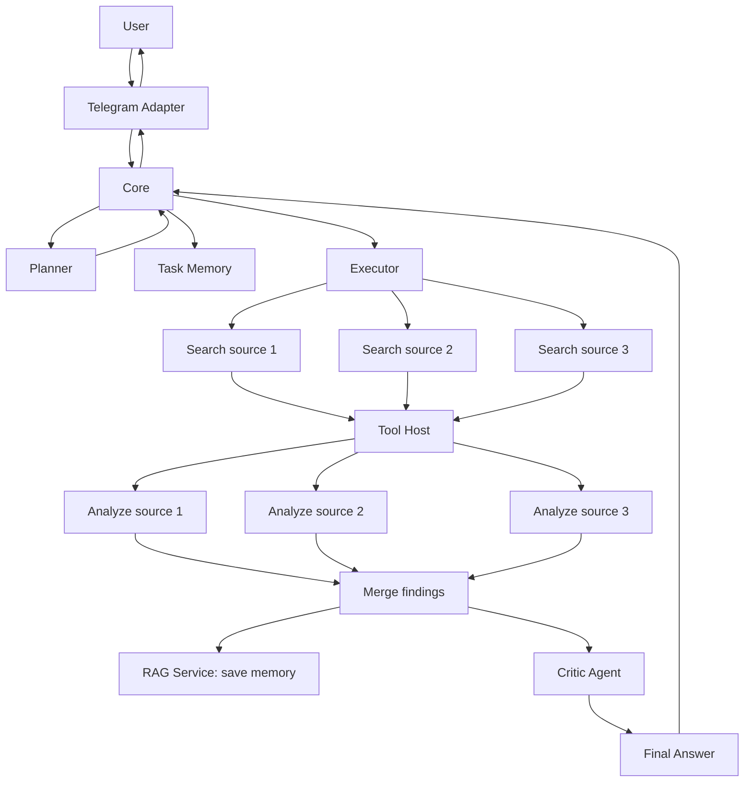

Здесь видны:

- параллельный поиск;
- анализ нескольких источников;
- объединение результатов;
- запись в память;
- проверка через Critic;
- финальный ответ.

## 8. Карта зависимостей процессов

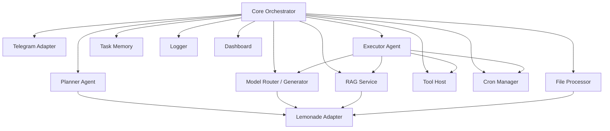

Core запускает и связывает процессы. Многие процессы зависят от Lemonade Adapter, потому что им нужна LLM, embeddings или vision-модель.

## 9. Главная визуальная формула

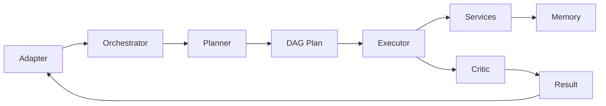

Запомни так:

```text
Adapter принимает внешний сигнал.
Orchestrator управляет системой.
Planner строит план.
Executor выполняет план.
Services делают конкретные действия.
Memory сохраняет состояние.
Critic проверяет качество.
Adapter возвращает ответ.
```

## 10. Как использовать эти схемы для своих проектов

Когда строишь свой проект, сначала нарисуй такую карту:

```text
1. Кто пользователь?
2. Где он пишет?
3. Кто принимает сообщение?
4. Кто управляет задачей?
5. Кто планирует?
6. Кто выполняет?
7. Какие сервисы нужны?
8. Где хранится память?
9. Как возвращается ответ?
```

Если ты можешь нарисовать этот путь, тебе намного проще писать код.

